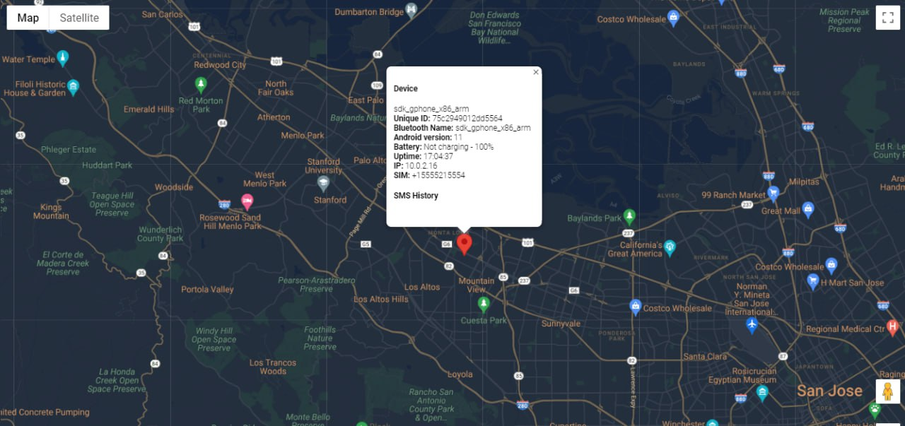
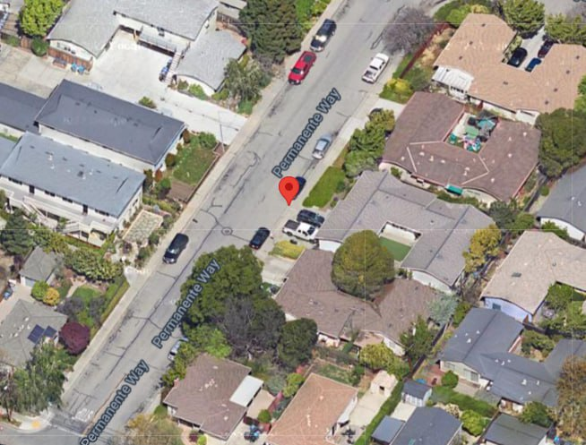

# android-stealer
 Android Studio APK Project to track GPS location, sms history, and device info with PHP handler
### How it works?
Basically i do this while is APK active in background and have Internet access to send the data in JSON format to my web server, you should check in files
`https://YOUR_REMOTE_SERVER/gps/` and replace that.  
App works normally in background, every 5 minutes sends data to web server.  
Minimal android version is **8.0**  
This app requires permissions:
1. SMS Access
2. Internet Access
3. Location (Accuracy)
4. Phone

### Pictures
#### This is how looks PHP handler - index.php
All devices should be displayed on google maps
* Keep in mind to change in index.php file `YOUR_GOOGLE_MAPS_API` to your.

## Disclaimer
This repository is for academic purposes, the use of this software is your responsibility.
